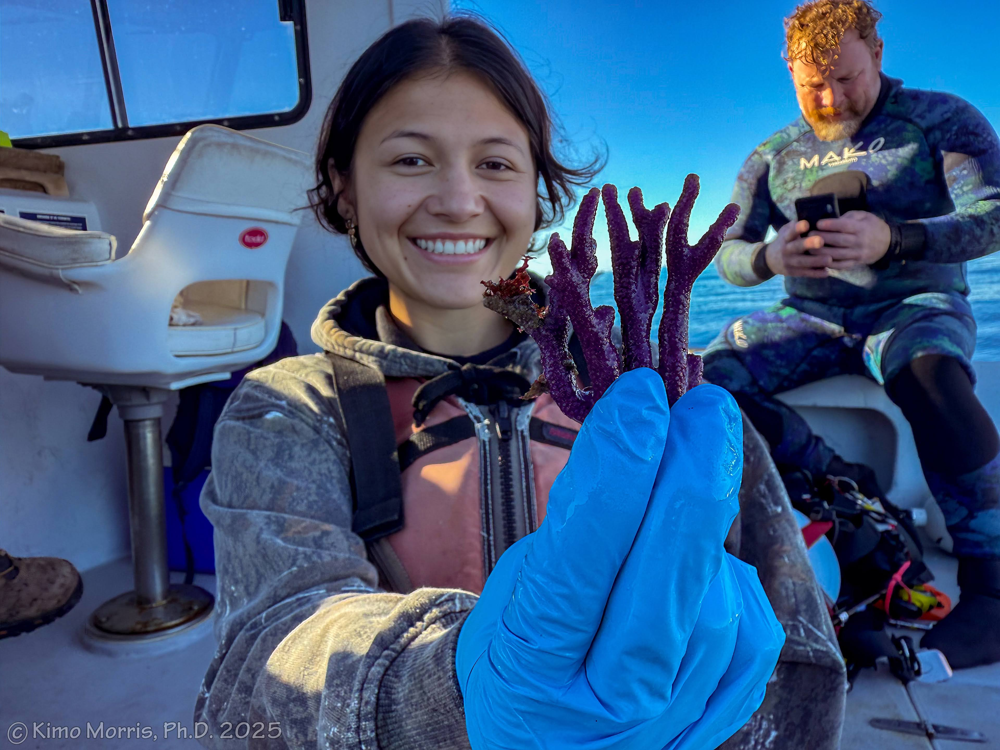

*Open Science*

This [open lab notebook](https://oliviamsimon.github.io/Open_Lab_Notebook/) contains methods products related to the work carried out for Olivia Simon's Ph.D. Dissertation at UCLA with Robert Eagle.
This notebook is platformed on GitHub and it is directly linked to GitHub repositories that contain further details presented in notebook posts. 

  

Photo Credit: Kimo Morris

- Credits: The realization of this lab notebook was inspired by the work of [hputnam](https://github.com/hputnam/Putnam_Lab_Notebook). This notebook is built with Jekyll Now, forked from [Barry Clark](https://github.com/barryclark/jekyll-now). 
